# Advanced Computer Networks – ENCS5321

## Course Project: BGP Scenario - Multi-AS Topology with Policy-Based Traffic Engineering

### Prepared by:
**Momen Assaf** (1191529)

### Instructor:
**Dr. Imad Tartir**

### Date:
13-01-2025

---

## Table of Contents
- [Topology](#topology)
- [Internal Configurations](#internal-configurations)
  - [AS100](#as100)
  - [AS200](#as200)
  - [AS300](#as300)
  - [AS400](#as400)
- [Redundancy Test](#redundancy-test)

---

## Topology
The topology follows the requested specifications:
- **AS100**: Uses OSPF100 and connects to a client network.
- **AS200**: Uses RIP.
- **AS300**: Uses OSPF200.
- **AS400**: Uses RIP (connected to a client for testing purposes).

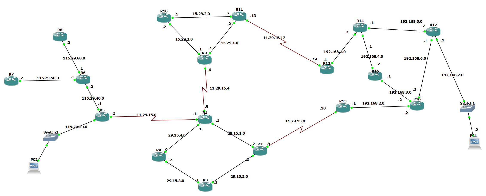

---

## Internal Configurations

### AS100
#### OSPF Configuration
- The OSPF is configured for internal networks within AS100.

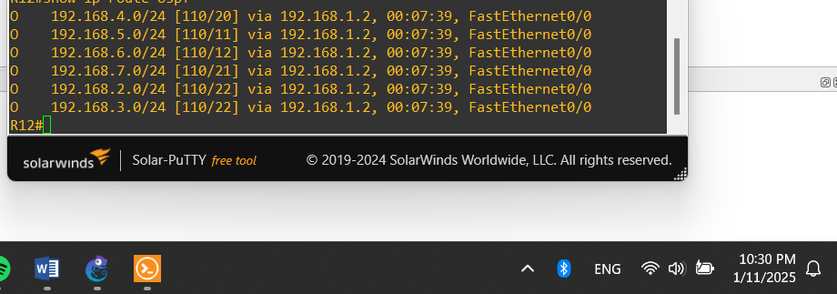

#### PC Ping Test
- Successful ping results show proper internal connectivity.

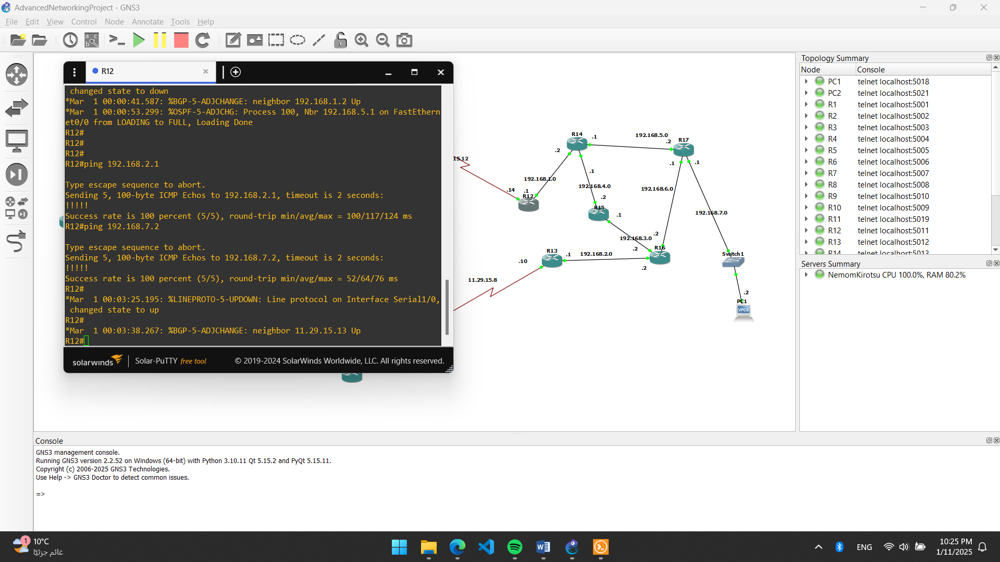

#### BGP Table
- Displays the networks reachable by **R12** from BGP.

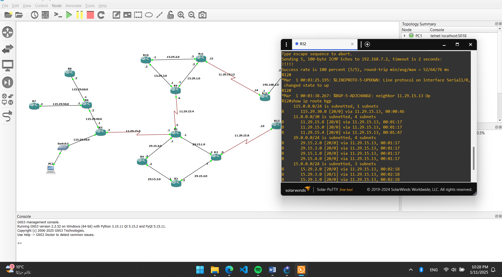

---

### AS200
#### RIP & BGP Table
- The RIP protocol is properly configured, displaying non-directly connected networks.
- The BGP table shows various connected networks.

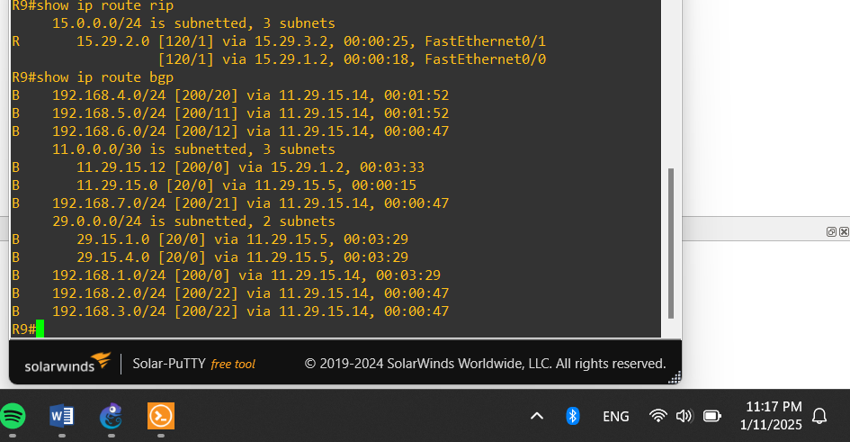

#### PC Ping Test
- The PC in AS200 can successfully reach its destination as indicated in the BGP table.

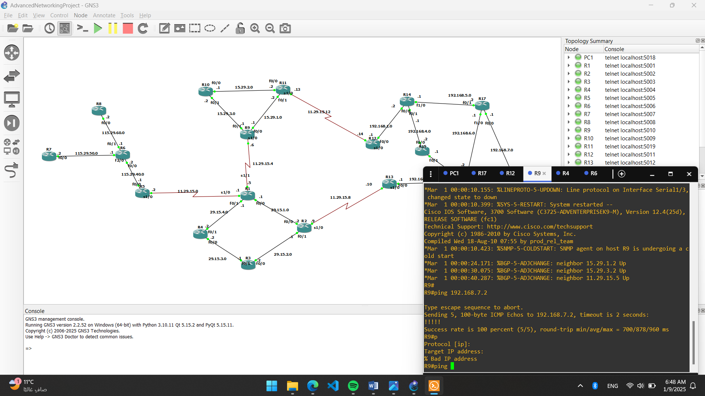

---

### AS300
#### OSPF & BGP Table
- The OSPF table includes external OSPF networks (E2).

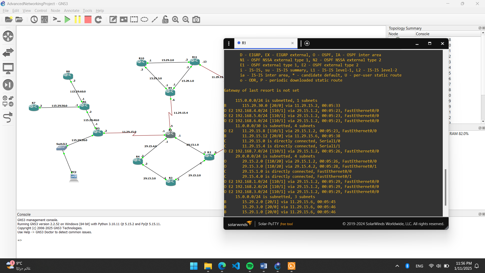

#### PC Ping Test
- Successful pings indicate proper network communication.

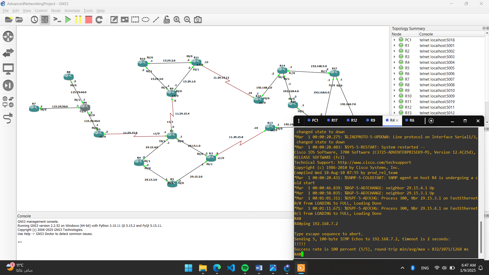

---

### AS400
#### RIP & BGP Table
- The RIP and BGP tables confirm proper network reachability.

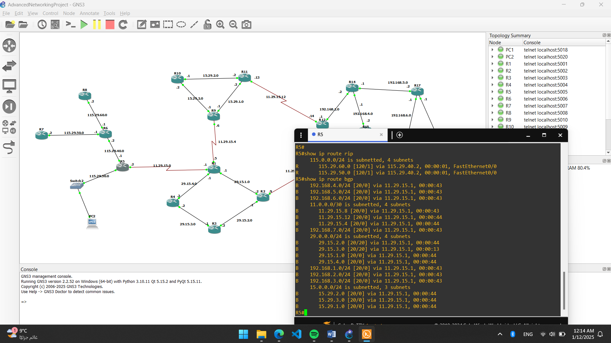

#### PC Ping Test
- The PC successfully communicates within AS400.

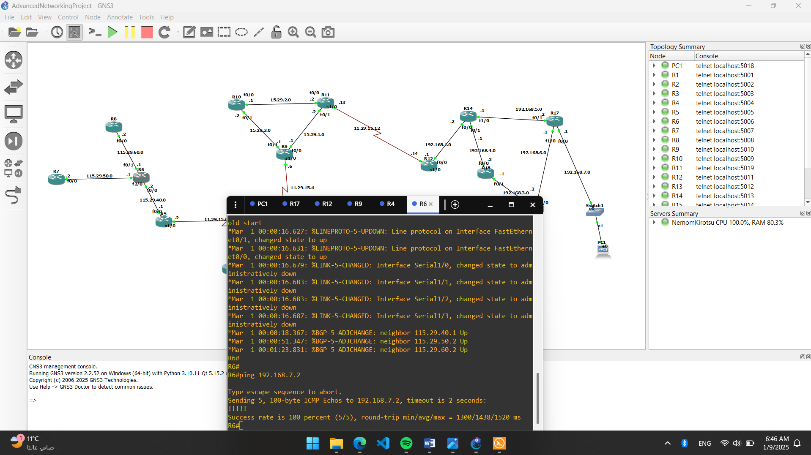

---

## Redundancy Test
- **Scenario 1:** In **AS100**, interface **f0/0** (connecting **R1 to R2**) was disabled. A ping test from **PC2 to PC1** showed initial packet loss but was successfully rerouted.

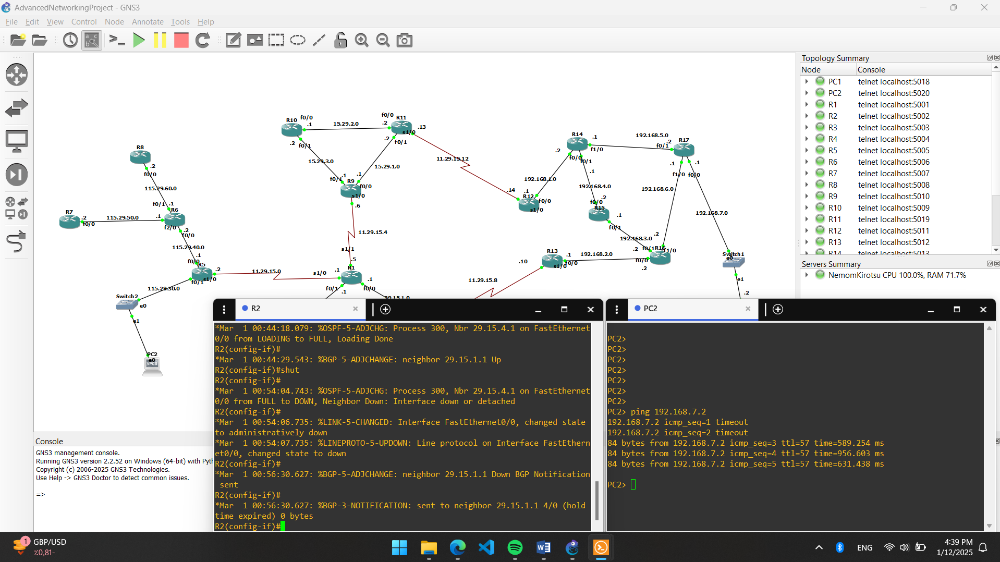

- **Scenario 2:** In **AS200**, the **s1/0 link (R11 to R12)** was shut down. The network traffic successfully rerouted through **AS300**, ensuring network resilience.

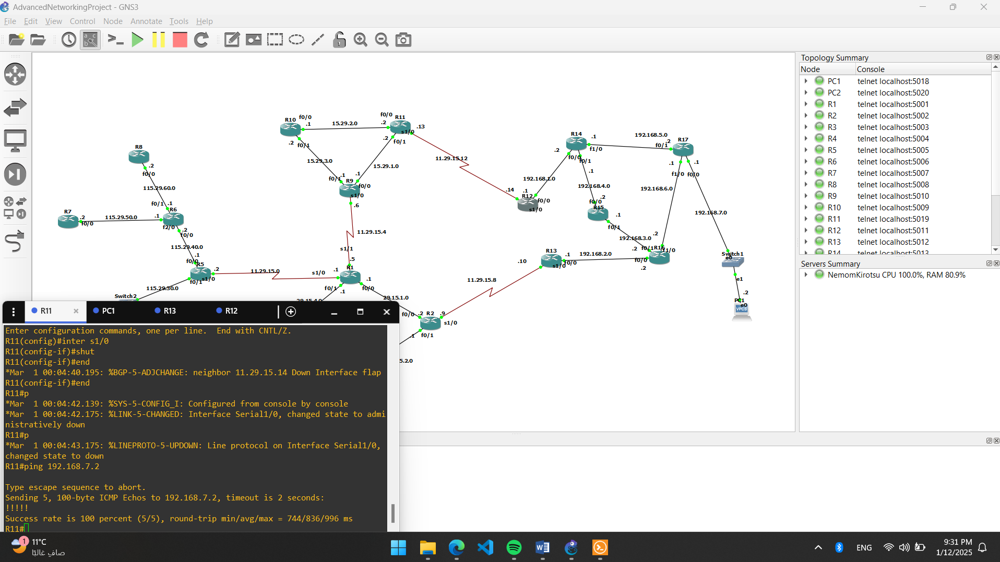

---

## Conclusion
The BGP-based multi-AS topology was successfully implemented with redundancy mechanisms ensuring continued network operation in case of failures. The results validate the effectiveness of policy-based traffic engineering in multi-AS environments.

---

**Note:** Ensure that the images are placed in the `images/` directory relative to this README file.
